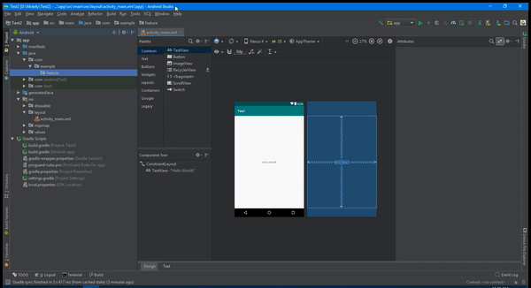

# Android Clean Arch Plugin

This plugin automate the creation of boilerplate needed to develop a new feature for an Android App. This plugin is based on the architecture defined in the following repo :
[https://github.com/android10/Android-CleanArchitecture-Kotlin](https://github.com/android10/Android-CleanArchitecture-Kotlin)

## Features

- Creates and configures feature files as following:
    - Activity
    - Fragment
    - ViewModel
    - Use case file structure
    - Data model file structure
    - Layout (Optional)
    - Manifest activity entry
- Using [Koin](https://insert-koin.io/) dependency injection framework for Kotlin.

## Package List
This plug-in is generate a new feature as a separate package and create the following folder structure for each feature :
-   feature
	-   data
		-   remote
			-   request
			-   response
		-   local
	-   view
	-   viewmodel
	-   usecase

## Usage



## Installing

Download .zip file from [releases](https://github.com/mohamedmenasy/clean-architecture-android-studio-plugin/releases) then tab and install it manually through :

```
Preferences/Settings -> Plugins -> Install plugin from disk...
```

# TODO

* Add DI
* Generate use cases
* Generate remote data model
* Generate remote requests and responses
* Generate local data model (Room)

## Versioning

* Initial version

## Authors

* **Mohamed Nabil** - *Initial work* - [Mohamedmenasy](https://github.com/mohamedmenasyh)
